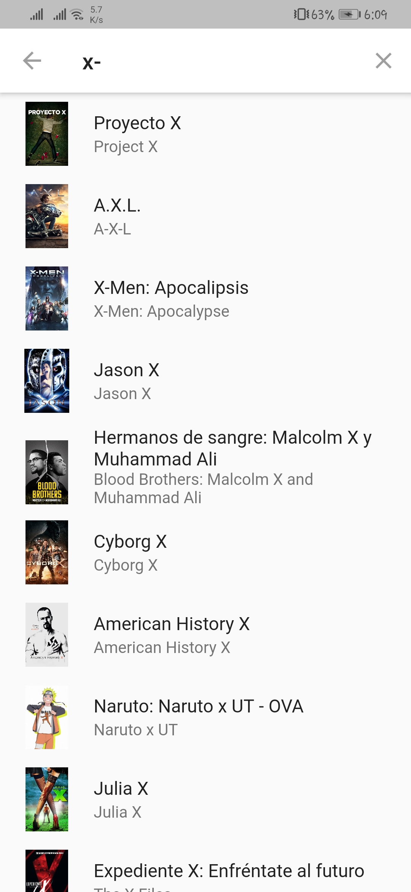

# Aplicación de Información Películas en Cines - Flutter

Creando una aplicación multiplataforma con Flutter, donde consultamos las películas que están actualmente en cines

### Algunas Capturas

     
     
     
     

 

## Expresiones de gratitud 🎁
* Estoy muy agradecido por todo lo que aprendí en el curso [Flutter: Tu guía completa de desarrollo para IOS y Android](https://www.udemy.com/course/flutter-ios-android-fernando-herrera) impartido por [Fernando Herrera](https://fernando-herrera.com/)
---
⌨️con ❤️por [gcristia](https://github.com/gcristia) 😊